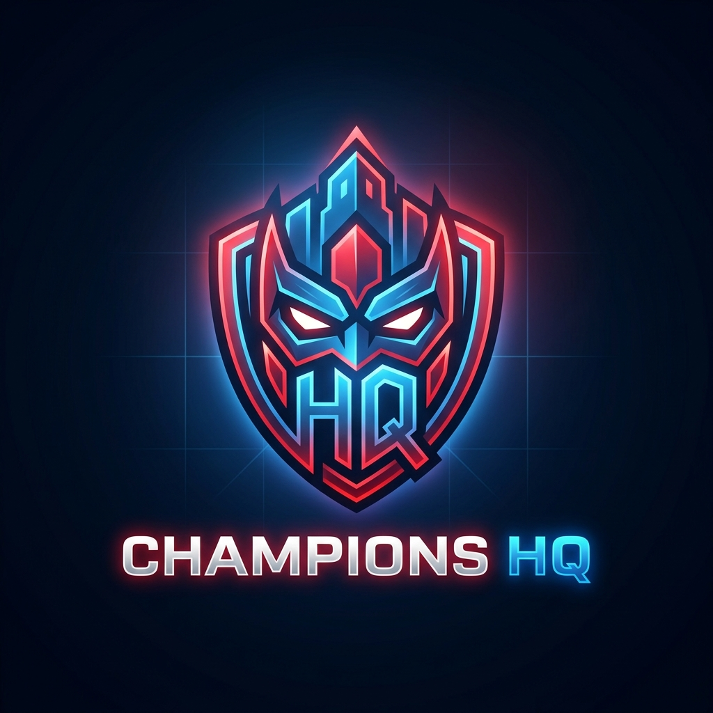

# Champions HQ



**Seu quartel-general definitivo para Marvel Champions LCG.**

## Sobre o Projeto
O **Champions HQ** é uma web application moderna, leve, **Mobile-First** e um **PWA (Progressive Web App)** criado para ajudar os jogadores do Card Game *Marvel Champions* a gerenciar sua coleção, buscar decks, acompanhar campanhas e monitorar suas mesas.

Todo o banco de dados do *MarvelCDB* está embutido no projeto, garantindo pesquisas e *match* de cartas em velocidade imediata, 100% offline-ready, com atualizações automáticas via GitHub Actions.

## Funcionalidades
- **Minha Coleção**: Ative e desative os pacotes de heróis e caixas que você possui fisicamente.
- **Banco de Decks**: Explore milhares de decks criados pela comunidade. Inclui o filtro inteligente "Apenas Cartas que Possuo".
- **Gerador de Caos**: Role os dados para um encontro 100% aleatório, selecionando um Vilão, um Herói e um Aspecto com animações responsivas.
- **Tracker Multiplayer P2P**: Monitor de Vida e Ameaça sincronizado em tempo real na mesa via WebRTC (PeerJS) de forma gratuita, sem backend, escaneando rapidamente um **QR Code** para conectar!
- **Campanhas**: Acompanhe o progresso de múltiplas campanhas, registrando vitória/derrota e salvando o histórico.
- **Guia de Regras Offline**: Dicionário interativo de palavras-chave, fases do vilão, FAQs e consulta dinâmica em popups na tela.
- **Temas e SFX**: Trilha sonora dinâmica e mudança de temas baseada nos Heróis que dão mais imersão às suas partidas.

## Tecnologias Usadas
- **React + Vite**
- **Vanilla CSS (Arquitetura Glassmorphism)**
- **WebRTC (PeerJS)** para Sincronização Multiplayer
- **Vite PWA** para modo de Aplicativo Offline
- **Scrapers em Node.js / Actions** (Raspagem Histórica e Diária)
- **Lucide Icons**

## Como Executar Localmente

```bash
# Instalar dependências
npm install

# Rodar o servidor de desenvolvimento
npm run dev

# Criar a Build de Produção
npm run build
```

## Direitos Autorais e Propriedade Intelectual
*Marvel Champions* e todos os textos das cartas, logos, personagens e artes pertencem exclusivamente à **Marvel** e à **Fantasy Flight Games (FFG)**.
Este aplicativo é uma iniciativa *Open Source* e estritamente sem fins lucrativos, feita de fãs para fãs, e não possui nenhuma afiliação oficial com a FFG, Marvel ou Disney.
